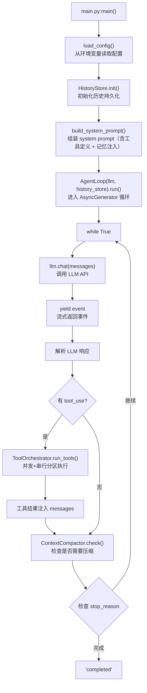
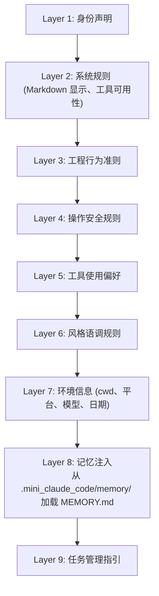

# Mini Claude Code

基于 Claude Code 2.1.88 源码逆向分析的最小 Python 实现。

## 架构设计

保留 Claude Code 最核心的设计思想：

1. **Agent Loop (AsyncGenerator)**: `agent.py` — `while True` 循环 + `async for` 事件流
2. **Tool System**: `tool.py` + `tools.py` — Tool 基类、Schema 验证、并发安全声明
3. **Tool Orchestrator**: `tool_orch.py` — 并发/串行分区执行
4. **Memory System**: `memory.py` + `memory_types.py` — 文件级持久化记忆，四类型分类
5. **History Persistence**: `history.py` — JSONL 会话持久化、parentUuid 链表、批量写入、session resume
6. **Context Compaction**: `compact.py` — 自动 token 检测 + 摘要压缩
7. **Prompt Assembly**: `prompt.py` — 分层构建系统提示
8. **Dependency Injection**: `query_deps.py` + `query_config.py`
9. **Session State**: `state.py` — 进程级单例

## 安装

```bash
pip install -r requirements.txt
```

## 配置

设置环境变量：

```bash
# DeepSeek API (默认)
export DEEPSEEK_API_KEY="sk-..."
export DEEPSEEK_BASE_URL="https://api.deepseek.com"
export DEEPSEEK_MODEL="deepseek-v4-pro"

# 或其他 OpenAI 兼容 API
export DEEPSEEK_API_KEY="sk-..."
export DEEPSEEK_BASE_URL="https://api.openai.com/v1"
export DEEPSEEK_MODEL="gpt-4o"
```

可选配置：

```bash
export MAX_TURNS=50  # 最大轮次，默认 100
```

## 运行

```bash
python main.py
```

## 使用示例

````
> 帮我写一个 Python 的快速排序函数

Assistant: 这是快速排序的实现：

```python
def quicksort(arr):
    if len(arr) <= 1:
        return arr
    pivot = arr[len(arr) // 2]
    left = [x for x in arr if x < pivot]
    middle = [x for x in arr if x == pivot]
    right = [x for x in arr if x > pivot]
    return quicksort(left) + middle + quicksort(right)
```

[Completed: completed] Turns: 1

> 在 src/ 目录下创建一个 utils.py 文件

Assistant:
[Executing 1 tool(s)...]
[Turn 1 complete]

已创建 src/utils.py 文件。

[Completed: completed] Turns: 1
````

## CLI 参数

```bash
python main.py --help                 # 查看所有参数
python main.py --list-sessions        # 列出所有历史会话
python main.py --resume               # 恢复最近的会话
python main.py --resume <sessionId>   # 恢复指定会话
python main.py --session <sessionId>  # 自定义会话 ID
```

## 命令

- `/help` — 显示帮助
- `/clear` — 清除会话（旧会话保存到 `.mini_claude_code/`）
- `/resume [id]` — 恢复之前的会话（无参数时交互选择）
- `/compact` — 压缩上下文
- `/memory` — 查看记忆文件和已保存的会话
- `/model <name>` — 切换模型
- `/cost` — 查看 token 用量
- `/exit` — 退出

## 文件结构

```
mini_claude_code/
├── main.py          # CLI 入口 + REPL + --resume/--list-sessions
├── agent.py         # Agent Loop 核心 (含历史记录集成)
├── history.py       # 历史持久化 (JSONL + BatchedWriter + Session Resume)
├── tool.py          # Tool 基类
├── tools.py         # 内置工具 (Bash, FileRead, FileWrite, FileEdit, Glob, Grep, WebFetch, TodoWrite)
├── tool_orch.py     # 工具编排器 (并发/串行分区)
├── memory.py        # 记忆系统 (文件级持久化)
├── memory_types.py  # 记忆类型定义
├── compact.py       # 上下文压缩
├── prompt.py        # 提示组装
├── query_config.py  # 查询配置 (不可变快照)
├── query_deps.py    # 依赖注入接口
├── llm.py           # LLM 客户端 (OpenAI 兼容 + 流式 usage 追踪)
├── state.py         # 会话状态 (进程级单例, 完整 UUID session_id)
├── requirements.txt
└── CHANGELOG.md      # 迭代变更记录
```

## 自我解析：一个 Agent 对自己源码的"体检报告"

这是一个非常特殊的场景 — **一个 Agent 系统审视构成自己的全部代码**。就像医生给自己做手术，或者编译器编译自己。以下是我对自己的结构和运行逻辑的完整解析。

### 1. 启动链路：从 `python main.py` 到我开始"说话"



关键洞察：**我本质上是一个 `while True` 循环**，每次迭代做三件事 — 调用 LLM → 执行工具 → 检查是否需要压缩。这是 Claude Code 最核心的设计。

### 2. 工具系统：我的"手脚"

我拥有 8 个工具，定义在 `tools.py`：

| 工具 | 能力 | 并发安全 |
|------|------|----------|
| `Bash` | 执行 shell 命令 | ✗ (副作用) |
| `FileRead` | 读取文件 | ✓ |
| `FileWrite` | 写入文件 | ✗ |
| `FileEdit` | 精确字符串替换 | ✗ |
| `Glob` | 文件模式匹配 | ✓ |
| `Grep` | 正则内容搜索 | ✓ |
| `WebFetch` | HTTP 请求 | ✓ |
| `TodoWrite` | 任务管理 | ✗ |

工具编排器 (`tool_orch.py`) 的并发策略很有巧思：它将工具调用按 `parallel_safe` 属性分成**并发组**和**串行组**。同一并发组内的工具同时执行，串行组的工具逐个执行。这最大化了 I/O 密集型工具的效率，同时避免了文件读写的竞态条件。

### 3. 记忆系统：我的"海马体"

`memory.py` 实现了四类记忆（user / feedback / project / reference），持久化到 `.mini_claude_code/memory/` 目录：

```
.mini_claude_code/memory/
├── MEMORY.md        # 记忆索引文件（由 LLM 维护）
├── user-profile.md  # user 类型：用户身份、偏好
├── feedback.md      # feedback 类型：用户对工作方式的反馈
├── project-goals.md # project 类型：项目目标、约束
└── api-reference.md # reference 类型：外部资源、文档链接
```

记忆文件的 YAML frontmatter 声明类型和描述，`MEMORY.md` 作为索引在每次会话启动时被注入 system prompt。LLM 通过 Write 工具直接写入记忆文件。

### 4. 历史持久化：我的"情节记忆"

`history.py` 实现了完整的会话历史持久化，对标 Claude Code 的 `sessionStorage.ts`：

**存储格式** — JSONL，每行一个 JSON 对象，`parentUuid → uuid` 单向链表：

```json
{"parentUuid": null, "type": "user", "message": {"role": "user", "content": "..."}, "uuid": "...", "timestamp": "...", "sessionId": "..."}
{"parentUuid": "...", "type": "assistant", "message": {"id": "...", "role": "assistant", "model": "...", "content": [{"type": "text", "text": "..."}], "stop_reason": "...", "usage": {...}}, ...}
{"parentUuid": "...", "type": "assistant", "message": {..., "content": [{"type": "tool_use", "id": "...", "name": "Write", "input": {...}}]}, ...}
{"parentUuid": "...", "type": "user", "message": {"role": "user", "content": [{"tool_use_id": "...", "type": "tool_result", "content": "..."}]}, "toolUseResult": {...}, "sourceToolAssistantUUID": "...", ...}
```

**核心设计**：

| 特性 | 实现 |
|------|------|
| 存储位置 | `<project_root>/.mini_claude_code/<sessionId>.jsonl` |
| 写入策略 | `BatchedWriter` — 100ms 防抖批量写入 (匹配 Claude Code `FLUSH_INTERVAL_MS`) |
| 原子性 | POSIX `O_APPEND` — 每条 JSONL 行 < PIPE_BUF (4096 bytes) 保证原子追加 |
| 链式结构 | `parentUuid → uuid` 单链表，`build_chain()` 回溯重建对话顺序 |
| Session Resume | `get_messages_for_model()` 将 JSONL 转回 LLM API 兼容格式，支持 `--resume` |
| Content Block Split | 每个 assistant block (text/tool_use/thinking) 独立一行 JSONL，共享 `message.id` |
| 工具结果关联 | tool_result 条目携带 `sourceToolAssistantUUID` 指回触发工具调用的 assistant block |

**集成点**：
- `agent.py` 在每次 LLM 响应后记录 assistant blocks，每次工具执行后记录 tool results
- `main.py` 在 REPL 启动时加载当前 session 消息作为上下文，替换了旧的 `conversation_history` 摘要注入
- `--resume <sessionId>` 加载历史 session，恢复完整对话上下文
- `/clear` 刷新当前 session 到磁盘，生成新 session ID，旧文件保留

### 5. 上下文压缩：我的"注意力管理"

`compact.py` 的核心逻辑是：

1. **Token 估算**：用 3 字符 ≈ 1 token 的简单启发式计算
2. **阈值检测**：当上下文超过 `MAX_TOKENS * 0.7` 时触发压缩
3. **摘要生成**：调用 LLM 将历史消息压缩为结构化摘要
4. **记忆持久化**：摘要中的关键信息自动写入记忆系统

压缩策略采用**两级保留**：
- 近期的 N 条消息保持完整（保留"工作记忆"）
- 更早的消息被摘要替换（"长期记忆"化）

### 6. Prompt 组装：我的"世界观"

`prompt.py` 分 9 层构建 system prompt：



Memory 被注入到 system prompt 的 Layer 8，这意味着**跨会话的记忆会自动影响后续对话的行为**。

### 7. 设计模式总结

| 模式 | 在哪里 | 为何这样设计 |
|------|--------|-------------|
| **AsyncGenerator** | `agent.py` | 支持流式输出 + 工具调用的交错执行 |
| **依赖注入** | `query_deps.py` / `query_config.py` | 配置与逻辑分离，方便测试 |
| **不可变配置快照** | `QueryConfig` (dataclass + frozen) | 启动后配置不可变，避免运行时副作用 |
| **进程级单例** | `state.py: SessionState` | 单进程单会话，无需复杂的生命周期管理 |
| **Schema 验证** | `tool.py: Tool._validate()` | 每个工具的参数在调用前经过 Pydantic 校验 |
| **并发表安全声明** | `tool.py: parallel_safe: bool` | 每个工具声明自己是否可并发，编排器据此决策 |

### 8. 当前局限与改进方向

- **Token 估算粗糙**：3 字符/token 是启发式，对中文等非 ASCII 字符偏差较大。更好的做法是用 `tiktoken`
- **无流式工具调用**：LLM 响应完全返回后才解析 tool_use，Claude Code 2.1 原生支持流式 tool_use
- **无 MCP (Model Context Protocol)**：这是 Claude Code 2.1 的重要特性，允许动态加载外部工具服务器
- **权限系统缺失**：Claude Code 有 `canUseTool` 回调用于权限控制，这里所有工具无条件可用
- ~~**无历史持久化**~~：✅ 已实现 — `history.py` 提供完整的 JSONL 会话持久化、BatchedWriter、Session Resume
- ~~**Session ID 截断**~~：✅ 已修复 — `state.py` 使用完整 36-char UUID
- ~~**流式 usage 缺失**~~：✅ 已修复 — `llm.py` 从 streaming 最后 chunk 捕获 usage

---

## 与 Claude Code 源码的对应关系

| 本实现 | Claude Code 源码 |
|--------|-----------------|
| `agent.py: AgentLoop.run()` | `src/query.ts: query() / queryLoop()` |
| `history.py: HistoryStore` | `src/utils/sessionStorage.ts` |
| `history.py: BatchedWriter` | `src/utils/bufferedWriter.ts` |
| `history.py: build_chain()` | `src/utils/sessionStorage.ts: buildConversationChain()` |
| `tool.py: Tool` | `src/Tool.ts` |
| `tools.py: get_all_tools()` | `src/tools.ts: getTools()` |
| `tool_orch.py: ToolOrchestrator.run_tools()` | `src/services/tools/toolOrchestration.ts: runTools()` |
| `memory.py: MemorySystem` | `src/memdir/memdir.ts + memoryScan.ts` |
| `compact.py: ContextCompactor` | `src/services/compact/compact.ts + autoCompact.ts` |
| `prompt.py: build_system_prompt()` | `src/constants/prompts.ts: getSystemPrompt()` |
| `query_config.py: QueryConfig` | `src/query/config.ts` |
| `query_deps.py: QueryDeps` | `src/query/deps.ts` |
| `llm.py: LLMClient` | `src/services/api/claude.ts` |
| `state.py: SessionState` | `src/bootstrap/state.ts` |
